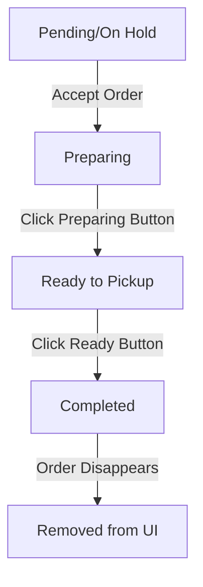
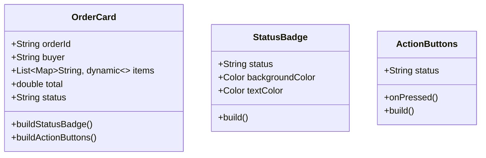

# Order Status UI Design Document

## 1. Overview

This document outlines the design for implementing a new order status management UI in the `order_screen.dart` file. The feature will allow POS users to track and update order statuses through a workflow: On Hold → Preparing → Ready to Pickup → Completed.

## 2. Requirements

The order status workflow should follow this sequence:
- When an order is created, it starts with "Pending" status, which should be displayed as "On Hold"
- When the POS user accepts the order, the status changes to "Preparing"
- When the "Preparing" button is clicked, the status changes to "Ready to Pickup"
- When the "Ready to Pickup" button is clicked, the status changes to "Completed" and the order disappears from the UI

## 3. Current Implementation Analysis

The current implementation in `order_screen.dart` has:
- Basic order status management with "Pending", "Accepted", and "Declined" statuses
- A StreamBuilder that fetches orders from Firestore
- Order cards displaying order details and status
- Accept/Decline buttons that update order status
- A payment success dialog that appears after accepting an order

## 4. Proposed Design

### 4.1 Status Workflow



### 4.2 UI Components

#### 4.2.1 Status Badges
Each status will have a distinctive visual representation:
- On Hold: Orange badge
- Preparing: Blue badge
- Ready to Pickup: Green badge
- Completed: Gray badge (before disappearing)

#### 4.2.2 Action Buttons
Each status will have specific action buttons:
- On Hold: "Accept" button to move to Preparing
- Preparing: "Mark as Ready" button to move to Ready to Pickup
- Ready to Pickup: "Complete Order" button to mark as Completed

### 4.3 Color Coding Scheme

| Status | Color | Description |
|--------|-------|-------------|
| On Hold | Orange | Order is pending acceptance |
| Preparing | Blue | Order is being prepared |
| Ready to Pickup | Green | Order is ready for customer pickup |
| Completed | Gray | Order is completed and will be removed |

## 5. Implementation Plan

### 5.1 Data Model Changes

Update the status mapping in the UI:
- "Pending" in database → "On Hold" in UI
- "Accepted" in database → "Preparing" in UI
- Add new statuses: "Ready to Pickup", "Completed"

### 5.2 UI Component Structure



### 5.3 Workflow Logic

1. When fetching orders, map database status to UI status:
   - "Pending" → "On Hold"
   - "Accepted" → "Preparing"

2. Implement new status transitions:
   - On Hold → Preparing (when Accept button is clicked)
   - Preparing → Ready to Pickup (when Mark as Ready button is clicked)
   - Ready to Pickup → Completed (when Complete Order button is clicked)

3. When an order is marked as "Completed", it should be filtered out of the UI

## 6. Detailed UI Design

### 6.1 Order Card Layout

```
+-----------------------------------------------------+
| Order #[ID]                              [On Hold]  |
| Buyer: [Buyer Name]                                 |
|-----------------------------------------------------|
| Items:                                              |
| [x2] Cappuccino                  P200.00            |
| [x1] Croissant                   P150.00            |
|                                                     |
|-----------------------------------------------------|
| Total:                              P350.00         |
|                                                     |
|                  [Accept Order]                     |
+-----------------------------------------------------+
```

### 6.2 Status Transition States

#### State 1: On Hold
- Status badge: Orange background with white text
- Button: "Accept Order" (Green)
- Action: Updates status to "Accepted" in database (shown as "Preparing" in UI)

#### State 2: Preparing
- Status badge: Blue background with white text
- Button: "Mark as Ready" (Green)
- Action: Updates status to "Ready to Pickup" in database

#### State 3: Ready to Pickup
- Status badge: Green background with white text
- Button: "Complete Order" (Gray)
- Action: Updates status to "Completed" in database and removes order from UI

## 7. Technical Implementation

### 7.1 Status Mapping Function

```dart
String mapStatusToUI(String dbStatus) {
  switch (dbStatus) {
    case 'Pending':
      return 'On Hold';
    case 'Accepted':
      return 'Preparing';
    case 'Ready to Pickup':
      return 'Ready to Pickup';
    case 'Completed':
      return 'Completed';
    default:
      return dbStatus;
  }
}
```

### 7.2 Status Update Function

```dart
Future<void> _updateOrderStatus(String docId, String newStatus) async {
  try {
    await _firestore.collection('orders').doc(docId).update({
      'status': newStatus,
      'timestamp': FieldValue.serverTimestamp(),
    });
    
    // If status is Completed, order will be filtered out in the next build
  } catch (e) {
    // Handle error
  }
}
```

### 7.3 UI Filter Function

```dart
// In the StreamBuilder, filter out completed orders
final orders = snapshot.data!.docs.where((doc) {
  final data = doc.data() as Map<String, dynamic>;
  final status = data['status'] ?? 'Pending';
  return status != 'Completed'; // Don't show completed orders
}).toList();
```

## 8. Testing Strategy

### 8.1 Unit Tests
- Test status mapping function with all possible status values
- Test that completed orders are filtered out of the UI
- Test that status update functions correctly update the database

### 8.2 Integration Tests
- Test the complete workflow from On Hold to Completed
- Test that UI updates correctly after each status change
- Test that orders disappear from UI when marked as Completed

### 8.3 UI Tests
- Test that correct buttons are displayed for each status
- Test that correct colors are used for each status badge
- Test that order cards are properly laid out for all screen sizes