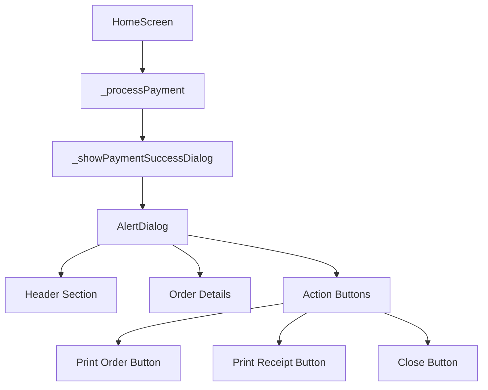

# Payment Dialog Creation Design Document

## 1. Overview

This document outlines the design for implementing a payment success dialog in the Kaffi Cafe POS application. When a user clicks the "Process Payment" button on the home screen, a dialog will be displayed showing payment confirmation, order details, and options to print both the order and receipt as PDF documents.

## 2. Technology Stack & Dependencies

- Flutter Framework for UI implementation
- pdf and printing packages for PDF generation and printing
- Existing project components: ButtonWidget, TextWidget, AppTheme
- Firebase Firestore for order data storage

## 3. Component Architecture

### 3.1 Component Definition

The payment dialog will be implemented as a method within the `_HomeScreenState` class in `home_screen.dart`. It will follow the existing pattern of dialogs used throughout the application.

### 3.2 Component Hierarchy



### 3.3 Props/State Management

The dialog will receive order data as a parameter from the `_processPayment` method. This data will include:
- Order ID
- Timestamp
- Items list with name, quantity, and price
- Subtotal, total amount, amount paid, and change

### 3.4 Lifecycle Methods/Hooks

The dialog will be displayed using Flutter's `showDialog` function which creates a modal dialog. The dialog will be dismissed when the user clicks any of the action buttons.

### 3.5 Example of component usage

```dart
_showPaymentSuccessDialog({
  'orderId': '1001',
  'timestamp': DateTime.now(),
  'items': [
    {'name': 'Cappuccino', 'quantity': 2, 'price': 120.00}
  ],
  'subtotal': 240.00,
  'total': 240.00,
  'amountPaid': 300.00,
  'change': 60.00
});
```

## 4. State Management

The dialog will receive order data as a parameter from the `_processPayment` method. This data will be stored temporarily in the dialog widget and used to populate the UI and generate PDFs.

## 5. API Integration Layer

### 5.1 PDF Generation Functions

Two separate PDF generation functions will be implemented:

1. `_generateOrderPdf(orderData)` - Creates a detailed order PDF
2. `_generateReceiptPdf(orderData)` - Creates a simplified receipt PDF

These functions will use the existing `pdf` and `printing` packages already configured in the project.

## 6. Testing Strategy

### 6.1 Unit Tests

| Component | Test Cases |
|-----------|------------|
| `_showPaymentSuccessDialog` | Renders correctly with valid data |
| `_generateOrderPdf` | Creates valid PDF with order data |
| `_generateReceiptPdf` | Creates valid PDF with receipt data |
| Data passing | Order data correctly passed to dialog |

### 6.2 Integration Tests

1. End-to-end payment flow including dialog display
2. PDF generation and printing workflow
3. Error handling scenarios

### 6.3 UI Tests

1. Dialog layout and appearance on different screen sizes
2. Button interactions and states
3. Data display accuracy